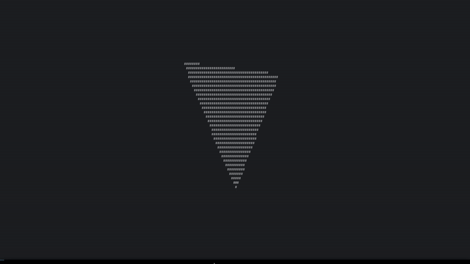

# 📌 Terminal Render Engine in C

**Terminal Render Engine in C** is a minimalist, graphics engine written entirely in C. It renders 3D scenes directly to the terminal. I wanted it to be simple and yet efficent engine that would demonstrate fundamental concepts of computer graphics, including vectors and matrices, quaternions, double buffering, rasterization, camera perspective projection and POSIX threading, all without relying on **external graphics library.**

### ✨ Features

- **Pure C Implementation:** Only standard C and terminal libraries. 🚀
- **Mathematics Engine:** Operations with vertices, matrices, quaternions and more. 🚀
- **Double Buffering:** Smooth animations with two framebuffers. 🚀
- **Rasterization:** Efficient triangle rasterization directly in terminal. 🚀
- **Camera & Perspective:** Custom camera system with perspective projection. 🚀
- **Basic Threading:** Simple POSIX threading implementation for optimization. 🚀

### 🎬 Example Output

